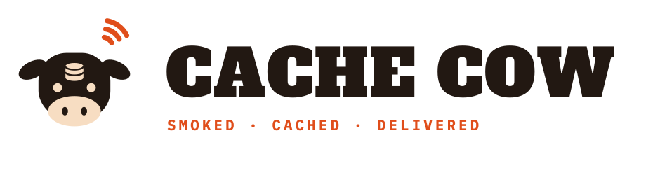

### SMOKED · CACHED · DELIVERED

**Regional BBQ, served from the nearest cold cache.**

---

## What is Cache Cow?

Cache Cow is a multi-market, direct-to-consumer and B2B commerce platform for **frozen BBQ products**. Think of it as a CDN for brisket: regionally smoked product is staged in regional cold stores (the "cache") and shipped to customers from the nearest node — with per-market catalogs, pricing, tax rules, and compliance regimes.

The name works on three layers: **cash cow** (revenue), **cache** (frozen inventory staged like edge nodes), and **cow** (the product — or, in India, the beloved mascot). The brand is a serious smokehouse run by people who think in systems.

## Markets & locales

Six launch markets, seven launch locales — each market with its own catalog, currency, tax treatment, and legal content:

| Market | Currency | Locale(s) | Notes |
|---|---|---|---|
| 🇺🇸 United States | USD | en-US | Full catalog, tax-exclusive pricing |
| 🇪🇸 Spain | EUR | es-ES | Full catalog, VAT-inclusive |
| 🇲🇽 Mexico | MXN | es-MX | IVA-inclusive pricing |
| 🇩🇪 Germany | EUR | de-DE | Full catalog, unit price per kg, Widerrufsrecht handling |
| 🇯🇵 Japan | JPY | ja-JP | Premium/gifting framing, konbini payment |
| 🇮🇳 India | INR | en-IN, hi-IN | **Vegetarian-only catalog**, FSSAI marking, UPI payment |

The India market is the platform's most important design constraint: non-veg SKUs are excluded **server-side** from every IN response — catalog, search, sitemaps, structured data, even caches — and the brand handles it by inversion, not omission (the paneer, jackfruit, and mushroom smoke program is the headline story).

## Subsystems

1. **Consumer storefront** — Angular SSR web storefront with market/locale switching
2. **Market, catalog & pricing engine** — policy-as-data regional gating, per-market prices in integer minor units
3. **Order, payment & fulfillment services** — idempotent ordering, Stripe/Razorpay processing, frozen-chain routing to regional cold stores (48-hour max transit)
4. **B2B API & wholesale portal** — versioned REST API and grocery-partner portal
5. **Internal operations dashboard** — sales, orders, invoices, inventory, partner and employee management
6. **Content pages** — Meet our Chefs, Meet our Cows, Meet our Cuts, and per-market legal content

## Repository status

**Bootstrap.** This repository currently contains specification documents and logo assets only — no application code, build system, or CI yet.

## Canonical documents

Each document owns exactly one domain:

| Document | Owns |
|---|---|
| [REQUIREMENTS.md](REQUIREMENTS.md) | **What** the system must do — testable requirements with `CC-*` IDs |
| [ARCHITECTURE.md](ARCHITECTURE.md) | **How** it's built — boundaries, stack, and all open decisions ("Known unknowns") |
| [SECURITY.md](SECURITY.md) | Every security requirement and control (OWASP ASVS 5.0 L2 baseline) |
| [DESIGN.md](DESIGN.md) | The design language governing all user-facing surfaces |
| [THREAT_MODEL.md](THREAT_MODEL.md) | The 2026-07-15 threat model whose findings were folded into the specs above |
| [REQUIREMENT_TEMPLATE.md](REQUIREMENT_TEMPLATE.md) | The structured template every GitHub issue must follow |
| [CLAUDE.md](CLAUDE.md) | Repo-operational guidance for AI-assisted work |

## Contributing

- Every GitHub issue follows [REQUIREMENT_TEMPLATE.md](REQUIREMENT_TEMPLATE.md) so it lands as a structured, testable requirement.
- Work items, PRs, and tests cite the `CC-*` requirement IDs they implement or verify.
- Open decisions (ARCHITECTURE.md "Known unknowns", `[ASSUMPTION]`, `TO BE CONFIRMED`) are resolved by humans, never improvised.

---

*The joke is discovered, never announced.*

