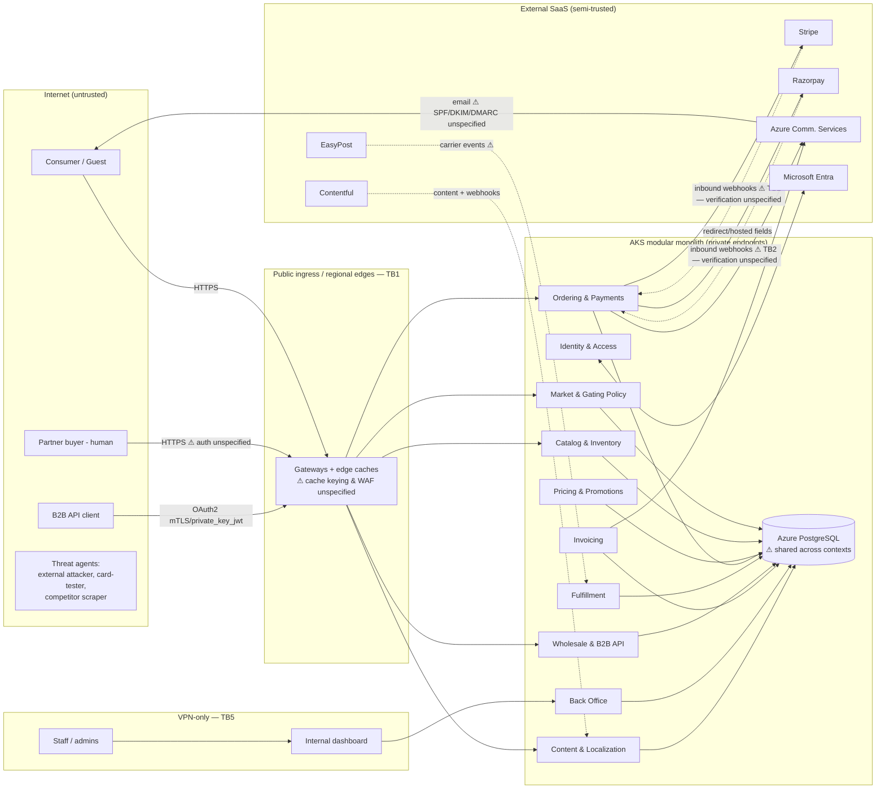

# Threat Model Report — Cache Cow Platform

**Date:** 2026-07-15
**Classification:** Internal
**Version:** 1.0
**Scope basis:** REQUIREMENTS.md v1.2, ARCHITECTURE.md v1.0, SECURITY.md v1.0, DESIGN.md v1.1 (design-time model; no application code exists yet)
**Machine-readable model:** [threat-model.cdx.json](threat-model.cdx.json) (CycloneDX Threat Modeling Blueprint 2.0)

---

## 1. Executive summary

Cache Cow's specification set is unusually strong for a pre-code project: ASVS 5.0 L2 baseline, RFC 9700 OAuth, mandatory passkeys for staff, server-side market gating with production probes, delegated card handling (SAQ A), and append-only audit requirements are all authored before the first line of code. This threat model therefore concentrates on what the documents **do not yet cover**, and on **internal contradictions** that would become vulnerabilities if implemented as written.

**Overall design-time risk: Moderate** — no critical flaws in what is specified; the risk lives in unspecified trust boundaries.

| Severity | Count |
|---|---|
| High | 5 |
| Medium | 11 |
| Low | 4 |

**Top risks in business terms:**

1. **Orders could be confirmed without payment.** The documents secure *outbound* webhooks to partners but say nothing about verifying *inbound* payment events from Stripe/Razorpay. A forged "payment succeeded" event ships frozen product for free (TM-01).
2. **Guest customers' orders and invoices are enumerable as specified.** Guest checkout is mandatory, invoices legally require *sequential* numbering, and invoice delivery is "a link to authenticated download" — but guests have no account to authenticate with. Without a defined access mechanism, the obvious implementation leaks every customer's order and address data (TM-02).
3. **The India compliance guarantee can be silently broken by a cache.** Multi-region edges are confirmed, but no rule requires caches to be keyed by market. One mis-keyed cache entry serves beef products into the IN market — the platform's single most important compliance rule — despite perfect server-side gating (TM-03).
4. **Two ratified architecture decisions contradict each other.** "Single primary write region" cannot simultaneously satisfy "EU data resident in EU" and "India data resident in India." This is flagged as a conflict for human decision, not resolved here (TM-04).
5. **Wholesale portal users have no specified authentication.** The authentication model covers consumers, staff, and B2B API clients — but not the human grocery-partner buyers who see wholesale prices and place case orders (TM-05).

**Key recommendations (all applied to the canonical documents in this change, except where marked as open decisions):** author inbound-webhook verification rules; define guest order/invoice capability-link access; mandate market+locale cache keying and ingress DDoS/WAF; harden email-code login; scope idempotency keys per principal; enforce audit append-only at the database-privilege level with WORM replication; add SPF/DKIM/DMARC, backup/DR, image-signing, and per-context database least-privilege rules; and add five new open decisions to ARCHITECTURE.md "Known unknowns."

---

## 2. Scope and methodology

### 2.1 System description

Multi-market (US, ES, MX, DE, JP, IN) D2C + B2B commerce platform for frozen BBQ: Angular SSR storefront, wholesale portal, VPN-restricted internal dashboard, versioned B2B REST API, ten server bounded contexts in an ASP.NET Core modular monolith on AKS, Azure PostgreSQL, Entra identity, Stripe/Razorpay payments, EasyPost carriers, Contentful CMS, ACS email.

### 2.2 Scope and exclusions

Everything specified in the four canonical documents. Excluded: v1 out-of-scope items (REQUIREMENTS.md §16), Contentful/Stripe/Razorpay/EasyPost/Azure internal security (treated as external trust assumptions), physical cold-store security.

### 2.3 Methodology

Per the threat-modeling prompt suite pipeline, adapted for a documentation-only repository:

- **Document & Architecture Absorption (06)** over REQUIREMENTS.md, ARCHITECTURE.md, SECURITY.md, DESIGN.md, CLAUDE.md, REQUIREMENT_TEMPLATE.md — assets, actors, flows, boundaries, controls, assumptions, contradictions.
- **STRIDE (00)** applied per component and per trust boundary.
- **LINDDUN (02)** applied to personal-data flows (GDPR, DPDP, APPI, CCPA all in scope).
- **Attack-tree analysis (03)** on three high-value objectives: "get product without paying," "read another customer's/partner's data," "serve beef into the IN market."
- **Consolidation (07)** into the unified CycloneDX model and this report (10).
- Repository Threat Reconnaissance (05) degenerates to document absorption: there is no code, CI, or IaC to scan.

### 2.4 Participants and perspective coverage

Single automated analyst (AI security analysis; security-engineering perspective). Per the suite's cross-functional rules this is a **single-perspective model** — see §2.5 limitations and §6.4.

### 2.5 Limitations

- **No code exists**: every control below has status *Specified — not implemented*. Nothing is verified; this model constrains design, it does not attest implementation.
- **Single-perspective blind spots** (follow-up sessions recommended): legal/privacy counsel (TM-04 residency, TM-19 guest DSR, DPDP/APPI scope), business stakeholders (TM-20 MX payment methods, fraud-loss appetite for TM-12), SRE/operations (TM-14 RPO/RTO targets), payments domain expert (TM-01/TM-12 processor-specific event flows).

---

## 3. System architecture (as absorbed)

### 3.1 Trust boundary and data flow overview

### 3.2 Trust boundaries

| ID | Boundary | Specified controls | Gap found |
|---|---|---|---|
| TB1 | Internet → public gateways (storefront/portal/API) | TLS, CSP, headers, rate limits, deny-by-default authz | No WAF/DDoS layer; no cache-keying rule for market-gated content (TM-03/10) |
| TB2 | External SaaS → platform (inbound webhooks: Stripe, Razorpay, EasyPost, Contentful) | None authored | Entire boundary unspecified (TM-01/13) |
| TB3 | Platform → external SaaS (outbound: payments, email, carriers, CMS) | Key Vault secrets, managed identity, SSRF rules, outbound webhook signing | Email authentication unspecified (TM-11); SaaS console access unspecified (TM-16) |
| TB4 | Consumer session ↔ wholesale tenancy | CC-WHS-003, dependency rule 3, object-level authz | Portal human authentication unspecified (TM-05) |
| TB5 | Staff/VPN → dashboard | Separate origin, VPN, passkeys, re-auth, RBAC, audit | Audit append-only not enforced at DB privilege level (TM-08) |
| TB6 | Application → PostgreSQL | Parameterized queries, field-level encryption | One store for all contexts; no per-context roles/schemas; TLS-to-DB unstated (TM-09) |
| TB7 | CI/CD & GitOps → clusters | Terraform-in-CI, policy-as-code, image scanning, merge gates | No image signing/provenance verification (TM-15) |
| TB8 | Region ↔ region (residency) | Residency commitments stated | Contradiction with single write region (TM-04) |
| TB9 | Guest (unauthenticated) → their own order/invoice data | None authored | Access mechanism undefined; sequential IDs (TM-02) |

### 3.3 Personal-data inventory (LINDDUN basis)

Consumer identity + delivery addresses (all markets), guest-checkout data (no account anchor), payment metadata (never PANs), order history, partner business identities (GSTIN/USt-IdNr.), employee records incl. compensation (field-encrypted), IP-derived geolocation, marketing consent state, security/audit logs (7-year financial retention). Regulatory regimes: GDPR (ES/DE/EU), DPDP 2023 (IN), APPI (JP), CCPA/CPRA (US).

---

## 4. Threat inventory

Status legend: **Fixed-in-docs** = mitigation authored into the canonical documents with this change. **Open decision** = surfaced to ARCHITECTURE.md "Known unknowns" per the repo working rule that conflicts and open items are flagged for humans, never resolved by an agent.

### TM-01: Forged or replayed inbound payment events confirm unpaid orders — **High**

- **Category:** STRIDE Spoofing/Tampering · OWASP API8 | **Boundary:** TB2 | **Assets:** Ordering & Payments, order state machine
- **Description:** SECURITY.md secured outbound partner webhooks (Secret handling 8, Input 8) but authored nothing for inbound event callbacks from Stripe, Razorpay, or EasyPost. The order state machine (`received → confirmed`) pivots on payment events.
- **Attack scenario:** Attacker discovers the webhook endpoint (guessable path, or leaked in config) → posts a fabricated `payment_intent.succeeded` for their own pending order → order confirms and ships without capture. Variant: replay of a genuine captured event to double-confirm; variant: treating the client's return-redirect from the processor as proof of payment.
- **Business impact:** Direct goods loss, chargeback exposure, false revenue recognition.
- **Existing controls:** None authored. **Mitigation:** SECURITY.md Input validation rule 11 (signature verification with Key Vault secrets, timestamp replay bounds, idempotent processing by provider event ID, authoritative API re-query, redirect-is-not-confirmation); REQUIREMENTS CC-ORD-010, CC-SEC-013; webhook-forgery/replay tests added to CC-QA-004. — **Fixed-in-docs.** Residual: Low.

### TM-02: Guest order tracking and invoice download are enumerable — **High**

- **Category:** STRIDE Information Disclosure · LINDDUN Identifiability/Disclosure · OWASP API1 (BOLA) | **Boundary:** TB9 | **Assets:** Ordering, Invoicing
- **Description:** CC-ORD-001 mandates guest checkout; CC-ORD-008 mandates order tracking; CC-INV-001 mandates *sequential* invoice numbers; CC-INV-002 mandates invoice delivery as "a link to authenticated download." Guests cannot authenticate. No document defines how a guest reaches their order or invoice — an unresolved requirements conflict whose default implementation (lookup by order/invoice number, or number-keyed URLs) is enumerable, exposing names and delivery addresses across all six markets.
- **Attack scenario:** Sequential invoice numbers are legally required and therefore predictable → iterate the invoice-download URL → harvest full customer name/address data at scale. GDPR/DPDP breach-notification territory.
- **Existing controls:** Object-level authz (Auth rule 9) exists but has no principal to bind guest resources to.
- **Mitigation:** REQUIREMENTS CC-ORD-009 (guest access only via unguessable, expiring, single-order capability links; order/invoice numbers are never access keys); SECURITY.md Authentication rule 13 (≥128-bit CSPRNG tokens, expiry, revocation, delivery only to the order's verified email); CC-INV-002 cross-reference; enumeration tests added to CC-QA-005. — **Fixed-in-docs.** Residual: Low (link-forwarding by recipients is accepted residual, consistent with the ratified link-only invoice decision).

### TM-03: Mis-keyed shared caches break IN market gating (cross-market cache poisoning) — **High**

- **Category:** STRIDE Tampering · LINDDUN Non-compliance | **Boundary:** TB1 | **Assets:** Edge caches, Market & Gating Policy, SSR storefront
- **Description:** ARCHITECTURE confirms regional edges and SSR; SECURITY.md's only caching rule is `no-store` on authenticated responses. Public catalog/search/sitemap responses are cacheable and *market-gated*. Nothing requires cache keys to include market+locale. A shared cache that keys on path alone serves a US-rendered beef PDP or sitemap into the IN market — defeating CC-MKT-003/004 without any server bug. Web-cache-poisoning via unkeyed headers (e.g., a market-override header) is the adversarial variant of the same flaw; the brand's own name is a warning label here.
- **Business impact:** FSSAI/regulatory exposure and severe brand damage in IN; the requirement DESIGN.md calls "the most important rule in this document."
- **Mitigation:** SECURITY.md HTTP boundary rule 10 (market+locale in every shared-cache key; gated responses never cached across markets; unkeyed-input poisoning in DAST scope); REQUIREMENTS CC-SEC-014; IN gating probe (CC-NFR-003) already asserts the end result in production — extended value noted. Edge/CDN provider selection raised as **open decision**. — **Fixed-in-docs + open decision.** Residual: Low-Medium until provider chosen and probed.

### TM-04: Single primary write region contradicts EU and India data-residency commitments — **High (compliance)**

- **Category:** LINDDUN Non-compliance · document conflict | **Boundary:** TB8
- **Description:** ARCHITECTURE.md ratifies both "single primary write region with regional read replicas" and "EU data resident in EU regions (GDPR); India data resident in India (DPDP)." If the primary write region is in the Americas, EU and IN order/PII writes land outside their residency zones (and replicas propagate them further). One of the two commitments must yield: per-residency-zone write primaries, data-class-scoped residency, or a revised residency claim.
- **Disposition:** Per repo working rules this is a **conflict to flag, not resolve** — added to ARCHITECTURE.md "Known unknowns" as a new open decision with the contradiction stated. — **Open decision.**

### TM-05: Wholesale portal human authentication is unspecified — **High**

- **Category:** STRIDE Spoofing/Elevation of Privilege | **Boundary:** TB4 | **Assets:** Wholesale portal, price lists, partner orders
- **Description:** The authentication model enumerates consumers, staff, and B2B *API clients* — not the human partner buyers using the wholesale portal. These users see wholesale prices (CC-WHS-003 protected), place case-quantity orders on net-60 terms, and view invoice history. An unspecified auth surface tends to get passwords-only by default.
- **Mitigation:** REQUIREMENTS CC-WHS-005 (phishing-resistant MFA required; password-only prohibited); SECURITY.md Authentication rule 15; identity provider for portal users raised as **open decision** (Entra External ID vs. per-partner federation). — **Fixed-in-docs + open decision.** Residual: Low once provider is chosen.

### TM-06: Email-code login brute force and account enumeration — **Medium**

- **Category:** STRIDE Spoofing | **Assets:** Consumer auth (Entra External ID + email codes)
- **Description:** Auth rule 3 permits email-code login but sets no code entropy, expiry, attempt limit, or enumeration-resistance requirements. A 6-digit code without attempt caps is brute-forceable; response differences reveal which emails hold accounts (also a LINDDUN Detectability issue).
- **Mitigation:** Auth rule 3 elaborated: single-use codes, ≥6 CSPRNG digits, ≤10-minute expiry, ≤5 verification attempts, throttled issuance, uniform responses. — **Fixed-in-docs.**

### TM-07: Idempotency-key replay across principals — **Medium**

- **Category:** STRIDE Information Disclosure/Tampering · OWASP API1 | **Assets:** Order submission (consumer + B2B)
- **Description:** CC-ORD-005/CC-API-005 require idempotency and "replays within the retention window MUST return the original result" — without stating that keys are scoped per principal. Globally-scoped keys let partner B replay partner A's key and receive A's order result (data leak), or poison A's expected result.
- **Mitigation:** CC-ORD-005/CC-API-005 amended (keys scoped to the authenticated principal or guest session); Auth rule 9 extended; cross-principal replay tests added to CC-QA-005. — **Fixed-in-docs.**

### TM-08: Audit-log tampering by privileged database access; 7-year durability — **Medium**

- **Category:** STRIDE Repudiation/Tampering | **Assets:** Append-only audit store
- **Description:** "Append-only" is asserted (Logging 6) but no mechanism is authored. Ordinary Postgres tables are mutable by any role with UPDATE/DELETE — including a compromised app credential or malicious DBA. Financial audit events must survive 7 years and insider pressure.
- **Mitigation:** Logging rule 6 extended: application roles hold INSERT-only privileges on audit tables; audit stream replicated to retention-locked (WORM) immutable storage so no single credential can both write and erase history. — **Fixed-in-docs.**

### TM-09: Shared PostgreSQL is a cross-context blast radius — **Medium**

- **Category:** STRIDE Elevation of Privilege/Information Disclosure | **Boundary:** TB6
- **Description:** One Flexible Server hosts all ten bounded contexts. With a single database role, any injection or logic flaw in one module (e.g., contact form) reaches employee compensation, partner terms, and audit data. Module boundaries enforced only in code evaporate at the connection string. TLS to the database is also unstated.
- **Mitigation:** Secret handling rule 9 (one least-privilege role per bounded context, confined to its own schema, no cross-context grants, TLS required on every data-store connection); ARCHITECTURE data-store bullet updated. — **Fixed-in-docs.**

### TM-10: No DDoS/WAF layer at public ingress — **Medium**

- **Category:** STRIDE Denial of Service | **Boundary:** TB1
- **Description:** Application-level rate limits exist, but 99.9% availability across six markets with a frozen-goods deadline (48h transit) has no volumetric-DDoS or WAF requirement. Kestrel rate limiting does not absorb network-layer floods.
- **Mitigation:** Folded into HTTP boundary rule 10 (ingress sits behind DDoS protection and a WAF as defense in depth, never a